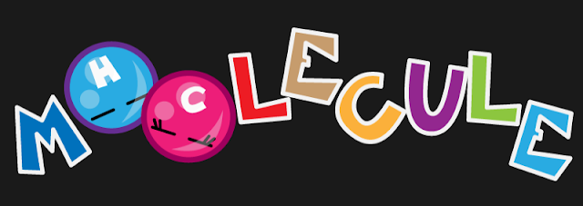

# Projects

## Strings
[Website](http://dsource.in/tool/string-your-story/)
[Facebook](https://www.facebook.com/StringYourStory)

## D'source e-Kalpa India
[Website](http://www.dsource.in/)
[App](https://play.google.com/store/apps/details?id=com.ekalpa.dsource)

## OCR + Ph.D. Thesis
Publication*

## FAR CRY® CLASSIC
[Wiki](https://en.wikipedia.org/wiki/Far_Cry_(video_game))
[PS3](https://www.playstation.com/en-us/games/far-cry-classic-ps3/)
[XBox](https://marketplace.xbox.com/en-us/Product/Far-Cry-Classic/66acd000-77fe-1000-9115-d8025841123e)
[Fandom](https://farcry.fandom.com/wiki/Far_Cry_Classic)

## Rubik's Cube Solver
[Blog](https://suvozit.blogspot.com/2011/06/rubiks-cube-solver.html)

# Bitsits Games
[Website](https://bitsits.blogspot.com)

## Sign Line
Unreleased*

## Treasure Island
[Blog](https://suvozit.blogspot.com/2010/12/small-update-for-treasure-island.html)

## Squares Vs Triangles
[Blog](https://suvozit.blogspot.in/2010/12/squares-vs-triangles.html)
[Video](https://suvozit.blogspot.com/2011/02/squares-vs-triangles-trailer.html)
[Windows Phone](https://suvozit.blogspot.com/2011/05/squares-vs-triangles-in-marketplace.html)

## Atooms to Moolecules
[Blog](https://suvozit.blogspot.com/2011/02/atooms-to-moolecule.html)
[Video](https://suvozit.blogspot.com/2010/10/atooms-to-moolecule-trailer.html)
[Video2](https://suvozit.blogspot.com/2011/02/atooms-to-moolecule-new-trailer.html)
[Windows Phone](https://suvozit.blogspot.com/2011/10/atooms-to-moolecule-in-marketplace.html)
[Steam](https://suvozit.blogspot.com/2012/06/atooms-to-moolecules-on-steam.html)

## Moolecules
[Blog](https://suvozit.blogspot.com/2010/07/moolecule.html)

## Apple e Apple
[Blog](https://suvozit.blogspot.com/2010/06/apple-e-apple.html)

## Speedy Crash
[Blog](https://suvozit.blogspot.com/2010/05/speedy-crash.html)

## Push Puzzle
[Blog](https://suvozit.blogspot.com/2010/04/push-puzzle.html)
[Video](https://suvozit.blogspot.com/2011/09/push-puzzle-trailer.html)
[Windows Phone](https://suvozit.blogspot.com/2011/04/push-puzzle-in-marketplace.html)

## Gombli
[Dev](https://suvozit.blogspot.com/2010/03/gombli-first-view.html)
[Blog](https://suvozit.blogspot.com/2010/03/gombli.html)
[Video](https://suvozit.blogspot.com/2011/08/gombli-demo.html)

