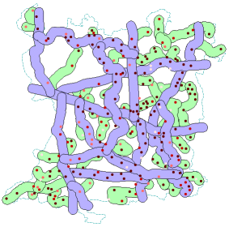

Publications
===

- S. Saha, G. Paul. **On Effective Sharing of User Generated Content**, In the Proceedings of IndiaHCI 2013 and APCHI 2013. September 24-27 2013. Bangalore, India.

  [PDF](https://github.com/suvozit/2013-APCHI/blob/master/ugc_aphci2013_CAMERA.pdf)
  [Poster](https://github.com/suvozit/2013-APCHI/blob/master/ugc%20poster.pdf)
  [ACM](https://dl.acm.org/citation.cfm?id=2525280)

- M. Agarwal, S. Saha. **Interactive Entertainment Software for Learning chemistry**, In the Proceedings of Grace Hopper Celebration of Women in Computing India. Bangalore, India. 2012.

  [PDF](https://github.com/suvozit/2012-Grace-Hopper-Celebration-of-Women-in-Computing-India/blob/master/Interactive%20Entertainment%20Software%20for%20Learning%20chemistry.pdf)

- M. Agarwal, S. Saha. **Environment Educational Game Design**, In the Proceedings of Grace Hopper Celebration of Women in Computing India. Bangalore, India. 2011.

  [PDF](https://github.com/suvozit/2011-Grace-Hopper-Celebration-of-Women-in-Computing-India/blob/master/Environment%20Educational%20Game%20Design.pdf)
  [Poster](https://github.com/suvozit/2011-Grace-Hopper-Celebration-of-Women-in-Computing-India/blob/master/Gombli%20poster-01.png)

- S. Saha, M. Agarwal. **Learning Chemistry through Puzzle Based Game: Atoms to Molecule**, In the Proceedings of 9th IEEE International Conference on Emerging eLearning Technologies and Applications 2011. Stara Lesna, Slovakia. 2011.

  [PDF](https://github.com/suvozit/2011-ICETA/blob/master/Learning%20Chemistry%20Through%20Puzzle%20Based%20Game%20-%20Atoms%20to%20Molecule.pdf)
  [IECTA](https://www.iceta.sk/_archiv/2011/proceedings/iceta2011_saha.pdf)
  [IEEE](https://ieeexplore.ieee.org/xpl/articleDetails.jsp?tp=&arnumber=6112613)

- S. Saha, Goutam Paul. **Cops and Robbers with Multiplicity**. Analyze the "cops and robber" game with the modification to the game rule that even cops are venerable, multiple robbers are present and multiple cops can sit in a single grid. The objective was to find the multiplicity of the cops required to catch all the robbers, where multiplicity is the number of cops that can be placed in a single grid.

  
  

- S. Saha, M. Agarwal. **Atooms to Moolecule (Game Design Abstract)**, In the Proceedings of SPAC TRIGGER Vol. 24 Delhi Technological University (IEEE Student Branch). Delhi, India. 2011.

  [PDF](https://github.com/BitSits/Atooms-to-Moolecules/blob/master/Jams%20%26%20Techfest/Troika.dcetech.com/trigger%20small.pdf)
  [DECTech](http://www.dcetech.com/ieee/wp-content/uploads/2011/04/trigger%20small.pdf)

- S. Alam, S. Saha, S. Biswas, **Application of GIS in Rural Road and Habitation Mapping**, Undergraduate Thesis for Civil Engineering at IIEST Shibpur. Howrah, India 2011.

      
  [PDF](https://github.com/iiests-CE-110407060/8th-Sem-Project/blob/master/Document.pdf)
  [Slides](https://github.com/iiests-CE-110407060/8th-Sem-Project/blob/master/Presentation.pdf)

